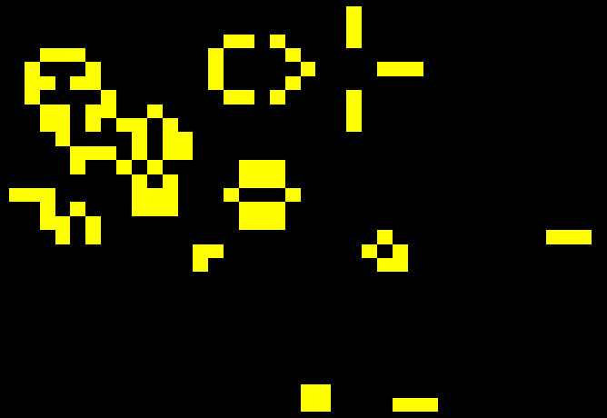

# GameOfLife

Conway's Game of Life implementation in C++ with SFML library.

# Requirements
* C++ compiler
* [SFML](https://www.sfml-dev.org/)

# Building 
Simply run these commands

`> cmake`

`> make`

# Usage
Left click a cell to set it alive/dead.
Space is used to pause or unpause the simulation.
